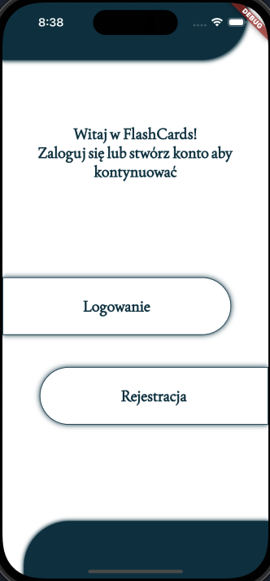
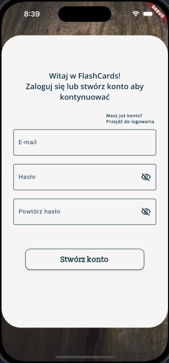
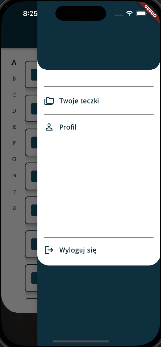
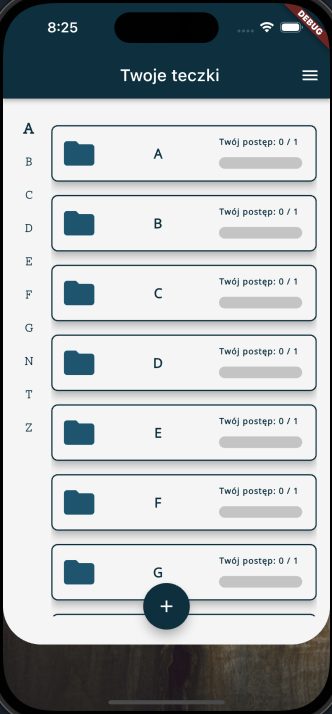
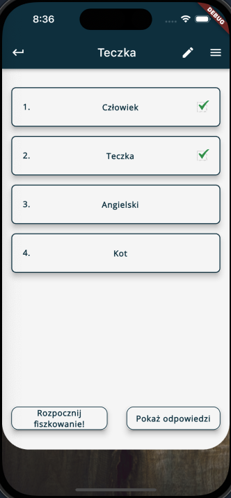
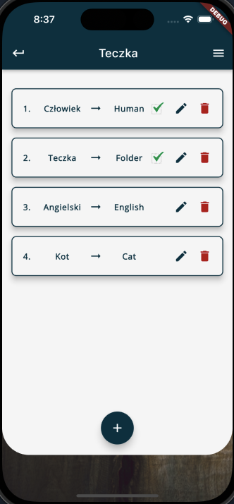

# flash_cards

# Getting started
Run generators to create required files to start app
```
flutter pub get 

flutter pub run build_runner build --delete-conflicting-outputs

flutter pub run intl_utils:generate

```


# Architecture and tech stack
App and data flow:
DataSource -> Repository -> UseCase -> Cubit -> Page

1. **DataSource** - calls to native platforms, external libraries and performs heavy lifting
2. **Repository** - calls data source and performs error handling
3. **UseCase** - represents single business process performed in app
4. **Cubit & Page** - presentation layer operations

## State management

- For [ephemeral state](https://flutter.dev/docs/development/data-and-backend/state-mgmt/ephemeral-vs-app) use [flutter_hooks](https://pub.dev/packages/flutter_hooks)
- For business logic use [flutter_bloc](https://pub.dev/packages/flutter_bloc)

## Desired file structure
This app's file structure is based on [Clean Architecture](https://pub.dev/packages/flutter_clean_architecture).
```
lib/
    app/                         	<-- application layer
        pages/
          login_page/
            page/
	             login_page.dart    <-- page
            cubit/
	            login_cubit.dart	<-- cubit or bloc
	            login_state.dart    <-- state
        widgets/                    <-- custom widgets
        utils/                    	<-- utility classes/constants, translations, router
        theme/	                  	<-- theme manager and theme data
    data/                         	<-- data layer
        repositories/
			auth_repository.dart 	<-- handles calls to data source and error handling
        data_source/
		    auth_data_source.dart   <-- calls to data source eg. data base or REST API
    device/                       	<-- device layer
        repositories/
	        camera_repository.dart 	<-- handles calls to data source and error handling
        data_source/
		    camera_data_source.dart <-- communicates with the platform
        utils/                      <-- any utility classes/functions
    domain/                       	<-- domain layer (business and enterprise) PURE DART
        entities/                   <-- enterprise entities (core classes of the app)
          user.dart
          manager.dart
        use_case/                   <-- business processes e.g. Login, Logout, GetUser, etc..
          login_use_case.dart       <-- example usecase extends `UseCase` or `CompletableUseCase`
        repositories/               <-- abstract classes that define functionality for data and device layers
    main.dart                     	<-- entry point

```

##  Testing strategy

Test every

- Cubit
- UseCase
- Repository
- DataSource

For mocking use [mockito](https://pub.dev/packages/mockito) and [bloc_test](https://pub.dev/packages/bloc_test).
**Protip:** Use `setMockMethodCallHandler()`  on `MethodChannel` class to mock response from platform channels.

## Presentation







